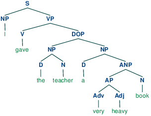

# Natural Language Processing

This repo contains the assignments that I did from March to May 2015 for the ["Natural Language Processing" course](https://ai.vub.ac.be/courses/2014-2015/natural-language-processing) teached by Prof. Beuls at the *Vrije Universiteit Brussel*. This course covered the classical approach to Natural Language Processing (i.e. no deep learning), and more specifically covered the following topics: regular expressions, n-gram models, part-of-speech tagging, speech recognition, parsing, unification, meanings and semantics.

The programming language used for the assignments was [Python](https://www.python.org/) along with the [NLTK library](http://www.nltk.org/).

## Assignment 1: Language Modeling
The goal of this assignment was to build a language model and to detect in which language a test document is written. For this purpose, I used a 3-gram letter model. Based on this model and on some training data (from Wikipedia), I was also able to generate some random output texts which have a "similarity" to real words written in the same language.

## Assignment 2: Chart Parser
The goal of this assignment was to build a chart parser which is appropriate for ambiguous grammars such as grammars of natural languages. I used the dynamic programming approach to solve the problem. From a practical point of view, the goal was to compute the parse tables, and from those generate the final parse trees.

For instance, here are the obtained parse trees for the following sentences:
* "I gave the teacher a very heavy book"
* "This is the cat that the dog chased"



## Assignment 3: Word Sense Disambiguation
The goal of this assignment was twofold: first, to simulate manually the original Lesk word overlap disambiguation algorithm, and second, to implement this algorithm using WordNet. The sentence to disambiguate was “Time flies like an arrow” in which each word should be disambiguated one at a time, from left to right, and in which earlier decisions are used later in the process.

## How to run the code?

Just type in the terminal:
```bash
python <assignment_name>.py
```